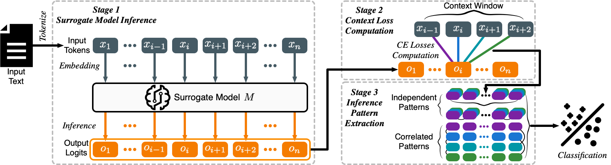

# Profiler: Black-box AI-generated Text Origin Detection via Context-aware Inference Pattern Analysis

Shield: [![CC BY 4.0][cc-by-shield]][cc-by]

This work is licensed under a
[Creative Commons Attribution 4.0 International License][cc-by].

[![CC BY 4.0][cc-by-image]][cc-by]

[cc-by]: http://creativecommons.org/licenses/by/4.0/
[cc-by-image]: https://i.creativecommons.org/l/by/4.0/88x31.png
[cc-by-shield]: https://img.shields.io/badge/License-CC%20BY%204.0-lightgrey.svg

---

Table of Contents
---
- [Profiler: Black-box AI-generated Text Origin Detection via Context-aware Inference Pattern Analysis](#profiler-black-box-ai-generated-text-origin-detection-via-context-aware-inference-pattern-analysis)
  - [Table of Contents](#table-of-contents)
  - [Overview](#overview)
  - [Dataset](#dataset)
  - [Code Implementation](#code-implementation)
    - [Code Structure](#code-structure)
    - [Running the Code](#running-the-code)
    - [Ablation Studies](#ablation-studies)
    - [Output Organization](#output-organization)
  - [Cite Our Work](#cite-our-work)

## Overview
- This is the official implementation for EMNLP 2025 paper "Profiler: Black-box AI-generated Text Origin Detection via Context-aware Inference Pattern Analysis".
- [[video](https://underline.underline.io/lecture/131017-profiler-black-box-ai-generated-text-origin-detection-via-context-aware-inference-pattern-analysis)\] | \[[slides](https://assets.underline.io/lecture/131017/slideshow/48706eaadc850c8537761da2b7678c86.pdf?Expires=1770585661&Signature=EmaGyKJ-MuvzQOHSmy0bBsj0zF4q5sFiM4dghH4aU9q8cw~VPWNMOIliR7~3eOB2LtA3oU8aVQfHv~L13zbuIsyyP5zYLlK~ca7C5SPvcqkxe3lwdsJw6TyxHpiPqtZ6c5F1Qa1yVaEFfKzoH7GZJe1yxiL4h36JoBsDWqHh0iDuvE5TGM6lucAnTMaLuv0oHlfBmR2-YUxUTY8Fkgna-5ElkpR-KFi4sxtbOQmMgJk2fMO~eO0Ode19ccE52ABwXrmF4c6sDxfPrTntLDDu4YlqDuvWjTmWAmHQ5auYGwCI52xohSytn0cyI78OGZESV8-8pUW1oWaTVBgOaOnQrw__&Key-Pair-Id=K2CNXR0DE4O7J0)\] | \[[poster](https://underline.io/lecture/131017-profiler-black-box-ai-generated-text-origin-detection-via-context-aware-inference-pattern-analysis?posterExpanded=true)\] | \[[paper](https://aclanthology.org/2025.emnlp-main.1265.pdf)\]

  

## Dataset
- Our dataset is located at `./Dataset` and `./Paraphrased_Dataset`.
- **Dataset Statistics:**
  - **6 Domains:** Arxiv, Code, Creative, Essay, GCJ, Yelp
  - **6 Sources:** Human + 5 AI models (GPT-3.5-Turbo, GPT-4-Turbo-Preview, Claude-3-Sonnet, Claude-3-Opus, Gemini-1.0-Pro)
  - **Total Samples:** 51,407 text samples (4,788 human + 46,619 AI)

    | **Domain** | **Human** | **AI-Generated** | **AI-Paraphrased** | **Total** |
    |------------|----------:|-----------------:|-------------------:|----------:|
    | Arxiv      | 350       | 1,750            | 1,750              | 3,850     |
    | Code       | 164       | 819              | 819                | 1,802     |
    | Creative   | 1,000     | 4,840            | 4,743              | 10,583    |
    | Essay      | 1,000     | 4,897            | 4,883              | 10,780    |
    | GCJ        | 274       | 1,370            | 1,370              | 3,014     |
    | Yelp       | 2,000     | 9,739            | 9,639              | 21,378    |
    | **Total**  | **4,788** | **23,415**       | **23,204**         | **51,407** |


## Code Implementation

### Code Structure

The project is organized into two main Python files:

- **profiler.py:**
  This is the main script that:
  - Parses command line arguments.
  - Sets up evaluation strategies:
    - **In-domain evaluation:** 5-fold cross validation when training and testing datasets are from the same distribution.
    - **Out-of-domain (OOD) evaluation:** Train on normal dataset, test on paraphrased dataset to evaluate robustness.
  - Implements **one-vs-all strategy** for multi-class origin detection:
    - For each of the 6 sources (human + 5 AI models), trains a separate binary classifier.
    - Reports ROC-AUC score for each source individually.
    - Computes average ROC-AUC across all 6 sources.
  - Saves feature files and evaluation results in a structured output directory.

- **profiler_utils.py:**
  Contains utility functions for feature extraction using pretrained language models from Hugging Face Transformers. The features are computed by:
  - Tokenizing text with a simple completion prompt.
  - Computing context loss sequences (controlled by `context_window`).
  - Extracting 5 statistics per context loss sequence: **mean, max, min, std, median**.
  - Computing KL divergence between different pairs of context loss sequences.
  - Aggregating features across multiple detection models (if ensemble is used).
  - Saving the features as pickle files.

---

### Running the Code

**1. Set up your environment:**
```bash
conda create -n profiler_env python=3.11
conda activate profiler_env
# install pytorch, please refer to https://pytorch.org/get-started/previous-versions/ to install the newest version that fits your device. We only show the install commands for the latest pytorch version.
pip3 install torch torchvision
# install other dependencies
pip install transformers scikit-learn tqdm numpy accelerate
```

**2. Run the code:**

First, please set up the GPU devices, e.g.,
```bash
export CUDA_VISIBLE_DEVICES=0,1
```

Then, you can run the code with the following command:
```bash
python profiler.py --task={task} --train_dataset={train_dataset} --test_dataset={test_dataset} --data_generation=1
```

**Example commands:**

*Standard Setting (5-fold CV on normal data):*
```bash
python profiler.py \
    --task Arxiv \
    --train_dataset normal_Arxiv \
    --test_dataset normal_Arxiv \
    --data_generation 1
```

*Paraphrased Setting (5-fold CV on paraphrased data):*
```bash
python profiler.py \
    --task Yelp \
    --train_dataset paraphrased_Yelp \
    --test_dataset paraphrased_Yelp \
    --data_generation 1
```

*OOD Setting (train on normal, test on paraphrased):*
```bash
python profiler.py \
    --task Essay \
    --train_dataset normal_Essay \
    --test_dataset paraphrased_Essay \
    --data_generation 1
```

**Argument Reference:**

| **Argument**      | **Default / Choices**                                                                                   | **Explanation**                                                                                                                                                                                                                                           |
|-------------------|---------------------------------------------------------------------------------------------------------|-----------------------------------------------------------------------------------------------------------------------------------------------------------------------------------------------------------------------------------------------------------|
| `--seed`          | *Default:* 42                                                                                           | Sets the random seed for reproducibility in Python's `random`, NumPy, and PyTorch.                                                                                                               |
| `--task`          | **Required** <br> *Choices:* `Arxiv`, `Code`, `Yelp`, `Essay`, `Creative`, `GCJ`                      | Specifies the task/domain for text origin detection.                                                                                                                                             |
| `--base_model`    | *Default:* `all` <br> *Choices:* `all`, `llama2-7b`, `llama2-13b`, `llama3-8b`, `gemma-2b`, `gemma-7b`, `mistral-7b`, or comma-separated list (e.g., `"llama3-8b,gemma-7b"`) | Specifies which detection model(s) to use for feature extraction. Default `all` uses all 6 models in an ensemble. Can specify a single model or comma-separated list for ablation studies.                                                |
| `--sample_clip`   | *Default:* 4000                                                                                         | Maximum character length for each text sample. Samples longer than this will be truncated.                                                                                                      |
| `--context_window` | *Default:* 6                                                                                           | Full context window size for context analysis computation. For example, `context_window=6` creates 6 target positions (±3 from center). Common values: 2, 4, 6, 8. |
| `--train_dataset` | **Required** <br> *Format:* `{normal or paraphrased}_{task}` (e.g., `normal_Arxiv`, `paraphrased_Yelp`) | Indicates the training dataset. The first part specifies whether the dataset is normal or paraphrased, and the second part specifies the task/domain.                                           |
| `--test_dataset`  | **Required** <br> *Format:* Same as `--train_dataset`                                                 | Indicates the testing dataset. If same as `--train_dataset`, performs 5-fold cross-validation. If different (e.g., train on `normal_Essay`, test on `paraphrased_Essay`), performs OOD evaluation. |
| `--data_generation` | *Default:* 0 <br> *Choices:* `0`, `1`                                                               | Whether to generate features (1) or load pre-computed features (0). Set to 1 for the first run to extract features.                                                                             |

---

### Ablation Studies

Profiler supports flexible ablation studies through the `--base_model` argument:

**1. Test individual detection models:**
```bash
# Test with llama3-8b only
python profiler.py --task Yelp --train_dataset normal_Yelp --test_dataset normal_Yelp --base_model llama3-8b

# Test with gemma-7b only
python profiler.py --task Yelp --train_dataset normal_Yelp --test_dataset normal_Yelp --base_model gemma-7b

# Test with mistral-7b only
python profiler.py --task Yelp --train_dataset normal_Yelp --test_dataset normal_Yelp --base_model mistral-7b
```

**2. Test model combinations:**
```bash
# Test with llama models only
python profiler.py --task Yelp --train_dataset normal_Yelp --test_dataset normal_Yelp --base_model "llama2-7b,llama3-8b,llama2-13b"

# Test with all models (default ensemble)
python profiler.py --task Yelp --train_dataset normal_Yelp --test_dataset normal_Yelp --base_model all
```

### Output Organization
- Results are automatically organized by model configuration
- Format: `./results/{train_dataset}_vs_{test_dataset}_model_{model_suffix}_context_window_{context_window}/`
- Examples:
  - All models: `normal_Arxiv_vs_normal_Arxiv_model_all_context_window_3/`
  - Single model: `normal_Arxiv_vs_normal_Arxiv_model_llama3-8b_context_window_3/`
  - Multiple models: `normal_Arxiv_vs_normal_Arxiv_model_llama3-8b+gemma-7b_context_window_3/`

---

## Cite Our Work
 If you find our work helpful, please consider citing our paper and giving us a star &star;:
 ```bibtex
 @inproceedings{profiler2025,
   title={Profiler: Black-box AI-generated Text Origin Detection via Context-aware Inference Pattern Analysis},
   author={Guo, Hanxi and Cheng, Siyuan and Jin, Xiaolong and Zhang, Zhuo and Shen, Guangyu and Zhang, Kaiyuan and An, Shengwei and Tao, Guanhong and Zhang, Xiangyu},
   booktitle={Proceedings of the 2025 Conference on Empirical Methods in Natural Language Processing (EMNLP)},
   pages={24892--24912},
   year={2025}
 }
 ```
